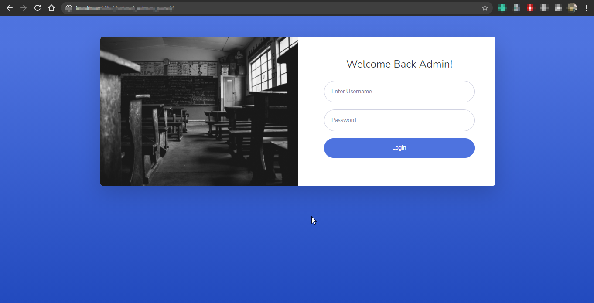

# Welcome to LearnersAcedemy User Guide! {docsify-ignore}

>LearnersAcedemy User Guide    
>Comprehensive guide describes the functions available in LearnersAcedemy.    

> Schools and most educational institutions use management systems which are highly evolved software platforms. Institutions need to run their functions in real-time using huge swaths of data and multiple factors. Using advanced website tools many functionalities are able to manage effectively. 

> These advanced technologies require extensive backend work. Hence many schools using websites that run on cutting edge technology are also reliant on tools which will ease backend work. LearnersAcademy admin templates are one of the most downloaded templates for schools and are considered the best school admin dashboard templates.

