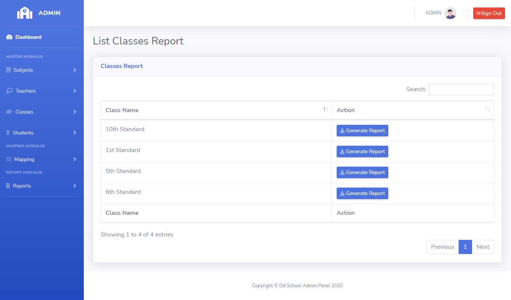
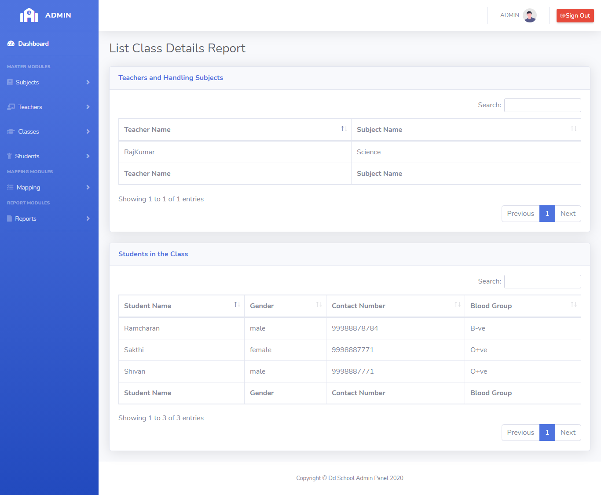

# LearnersAcademy Classes-Report

## Introduction

> LearnersAcademy Classes-Report Menu as a modules for view the class report.

## View Classes-Report

> In the View Classes-Report menu, Admin can able to view the classes list in the school.

> By Clicking any particular class, Admin can view the list of students in that class and What are the subjects taken for that class and By Whom the subjects are taken

## How to View Classes-Report?

> View Report button is available for every row level in the class report table, By Clicking the View Report button redirects to the report page which consists of two table.
First Table list the Subjects and Handling Teachers followed by the another table has set of students in that class.
 

 
   
{docsify-updated}

