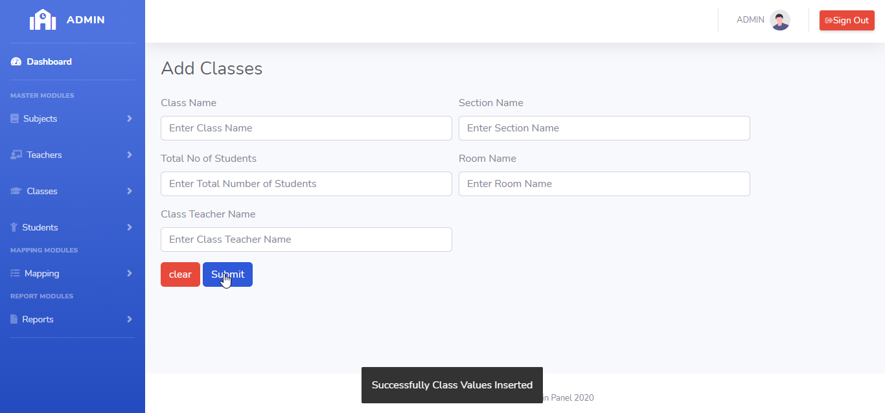

# LearnersAcademy Classes

## Introduction

> LearnersAcademy Classes Menu as two modules for Adding the Classes and Listing the Classes in the School.

## Adding Classes

> In the Adding Classes menu, Admin can able to add any number of unique Classes to the School.

> In the Adding Classes menu, Submit Button is used to submit the Classes values to the database and clear button is for clearing the form.

## How to Add Classes?

> Admin needs to enter mandatory fields in the add classes form. On clicking the submit button Classes details saved to the database.
 

 

#### Errors & Warnings

The below warning / error message will be displayed to the user in case of any invalid action.
The warning / error messages are self explanatory, here are few examples.

!>**Enter the Class Name**
	- If the user tries to submit in without entering the Class Name.
	
!>**Enter the Total Number of Students**
	- If the user tries to submit in without entering the Total number of students in the class.
	

!>**Classes Already Exists,Kindly try to add different Classes**
	- If the user tries to submit the same class name.
	

   
{docsify-updated}

