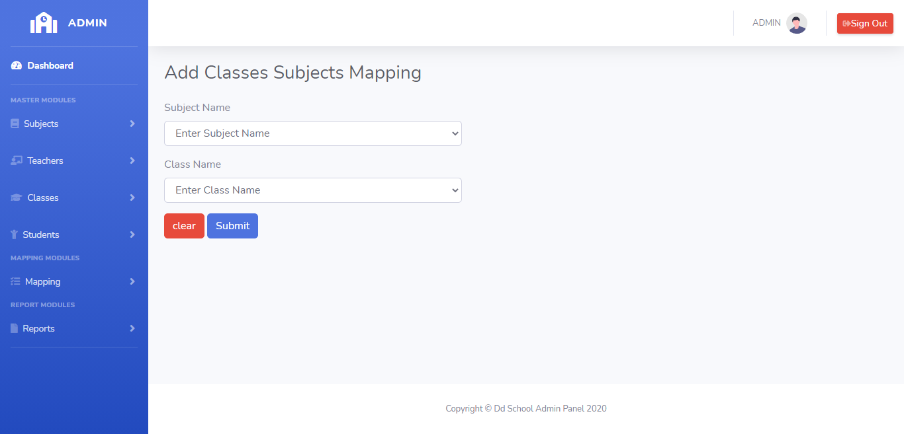

# LearnersAcademy Classes-Subjects Mapping

## Introduction

> LearnersAcademy Classes-Subjects Menu as two modules for Adding the Classes-Subjects and Listing the Classes-Subjects in the School.

## Adding Classes-Subjects Mapping

> In the Adding Classes-Subjects menu, Admin can able to Map any number of unique Classes-Subjects to the School.

> In the Adding Classes-Subjects menu, Submit Button is used to submit the mapped Classes-Subjects values to the database and clear button is for clearing the form.

## How to Add Classes-Subjects Mapping ?

> Admin needs to enter mandatory fields in the add Classes-Subjects form. On clicking the submit button Classes-Subjects Mapping details saved to the database.
 

 

#### Errors & Warnings

The below warning / error message will be displayed to the user in case of any invalid action.
The warning / error messages are self explanatory, here are few examples.

!>**Enter the Class Name**
	- If the user tries to submit in without entering the Class Name.
	
!>**Enter the Subject Name**
	- If the user tries to submit in without entering the Subject Name.
	

!>**Classes-Subjects Already Exists,Kindly try to add different Classes-Subjects**
	- If the user tries to submit the same class name and subject name.
	

   
{docsify-updated}

