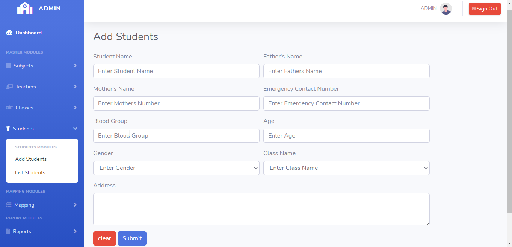
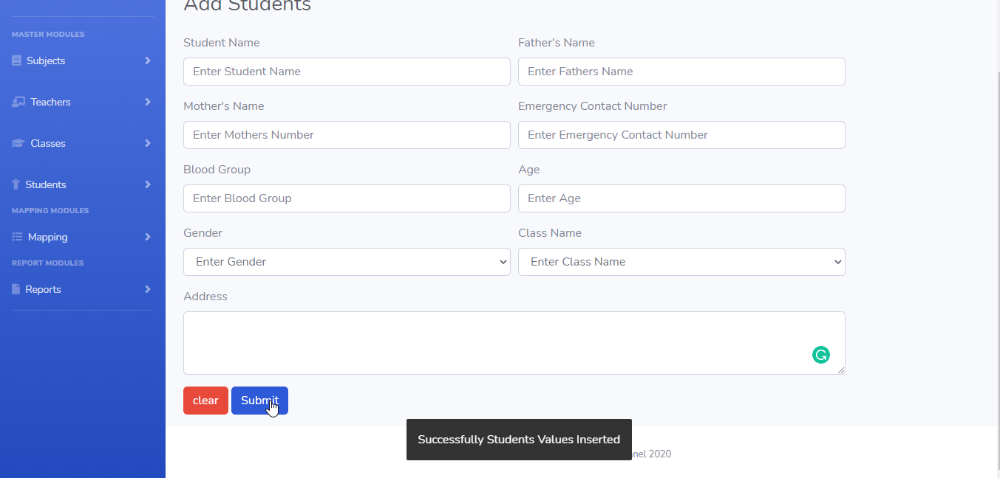
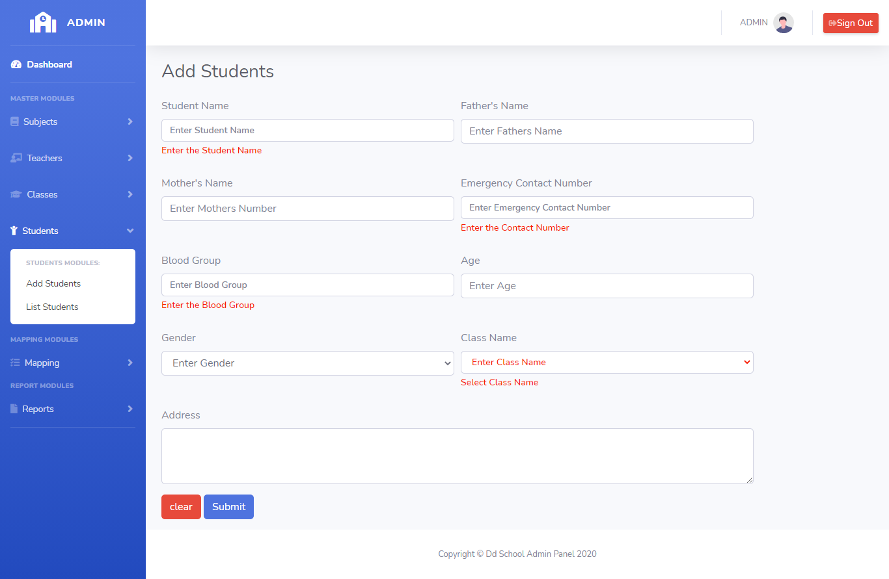
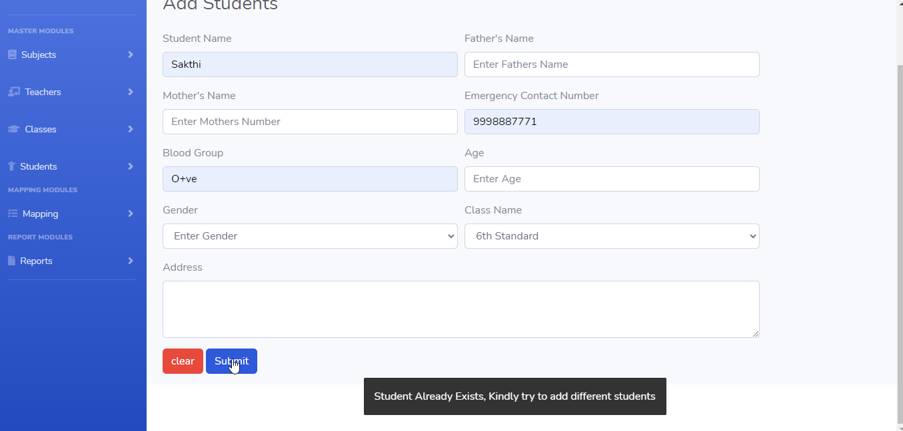

# LearnersAcademy Students

## Introduction

> LearnersAcademy Students Menu as two modules for Adding the Students and Listing the Students in the School.

## Adding Students

> In the Adding Students menu, Admin can able to add any number of unique Students to the School.

> In the Adding Students menu, Submit Button is used to submit the Students values to the database and clear button is for clearing the form.

## How to Add Students?

> Admin needs to enter mandatory fields in the add students form. On clicking the submit button Students details saved to the database.
 

 

#### Errors & Warnings

The below warning / error message will be displayed to the user in case of any invalid action.
The warning / error messages are self explanatory, here are few examples.

!>**Enter the Student Name**
	- If the user tries to submit in without entering the Student Name.
	
!>**Enter the Contact Number**
	- If the user tries to submit in without entering the Emergency contact Number of the Student.
	
!>**Enter the Blood Group**
	- If the user tries to submit in without entering the Blood Group.
	
!>**Enter the Class Name**
	- If the user tries to submit in without entering the class name enrolled.
	
	

!>**Students Already Exists,Kindly try to add different Students**
	- If the user tries to submit the same class name.
	

   
{docsify-updated}

