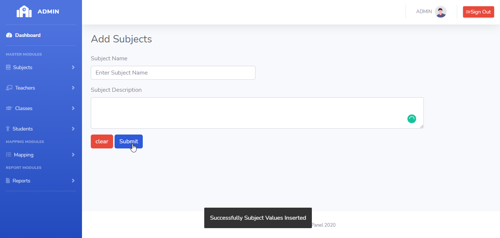

# LearnersAcademy Subjects

## Introduction

> LearnersAcademy Subject Menu as two modules for Adding the Subjects and Listing the Subjects in the School.

## Adding Subjects

> In the Adding Subjects menu, Admin can able to add any number of unique subject names to the School.

> In the Adding Subjects menu, Submit Button is used to submit the subject values to the database and clear button is for clearing the form.

## How to Add Subjects?

> Admin needs to enter the subject name in the subject name textbox and subject description in the description text box. On clicking the submit button subject, details saved to the database.
 

 

#### Errors & Warnings

The below warning / error message will be displayed to the user in case of any invalid action.
The warning / error messages are self explanatory, here are few examples.

!>**Enter the Subject**
	- If the user tries to submit in without entering the subject name.
	

!>**Subjects Already Exists,Kindly try to add different Subjects**
	- If the user tries to submit the same subject name.
	

   
{docsify-updated}

