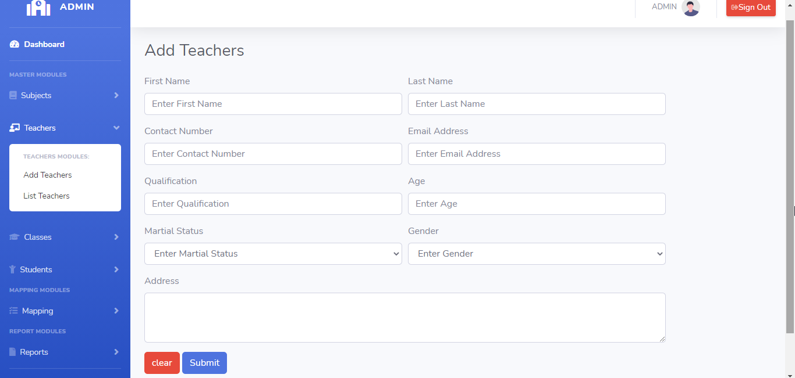
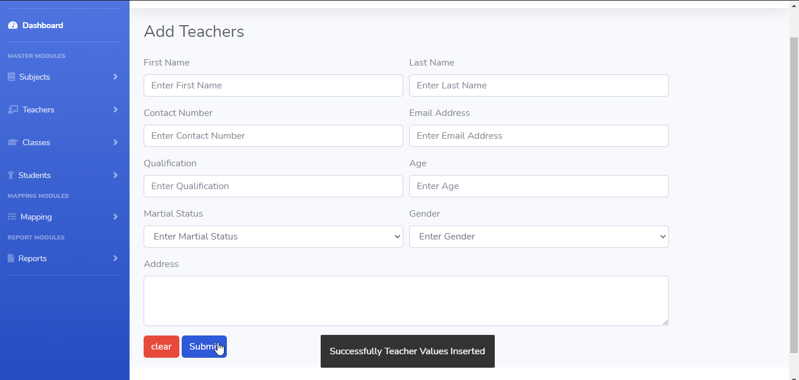
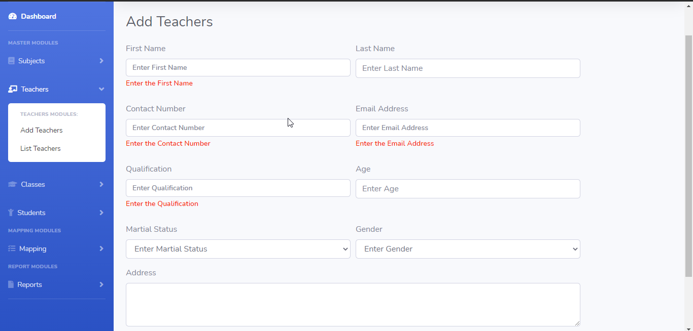
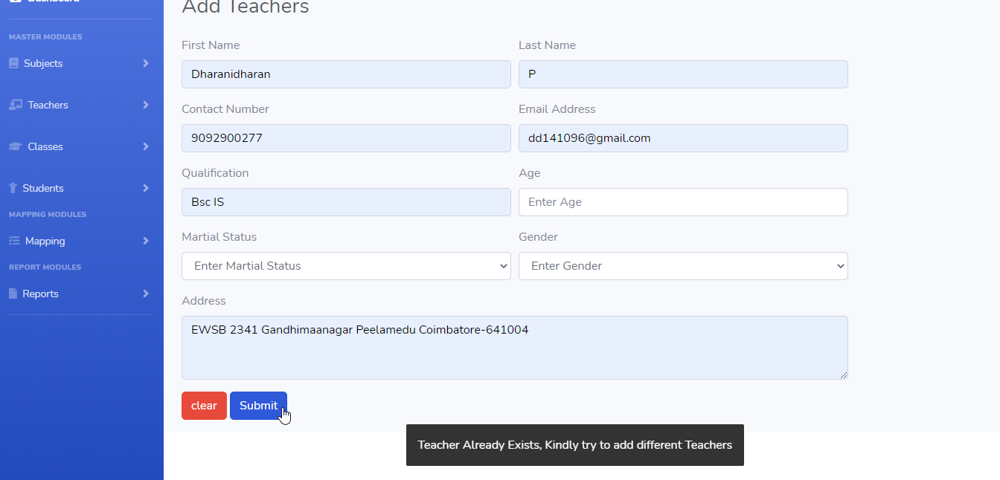

# LearnersAcademy Teachers

## Introduction

> LearnersAcademy Teachers Menu as two modules for Adding the Teachers and Listing the Teachers in the School.

## Adding Teachers

> In the Adding Teachers menu, Admin can able to add any number of unique Teachers to the School.

> In the Adding Teachers menu, Submit Button is used to submit the Teachers values to the database and clear button is for clearing the form.

## How to Add Teachers?

> Admin needs to enter mandatory fields in the add teachers form. On clicking the submit button Teachers details saved to the database.
 

 

#### Errors & Warnings

The below warning / error message will be displayed to the user in case of any invalid action.
The warning / error messages are self explanatory, here are few examples.

!>**Enter the First Name**
	- If the user tries to submit in without entering the First Name.
	
!>**Enter the Contact Number**
	- If the user tries to submit in without entering the Contact Number.
	
!>**Enter the Email Address**
	- If the user tries to submit in without entering the Email Address.
	
!>**Enter the Qualification**
	- If the user tries to submit in without entering the Qualification.
		

!>**Teachers Already Exists,Kindly try to add different Teachers**
	- If the user tries to submit the same First name, Contact Number and Email Address.
	

   
{docsify-updated}

