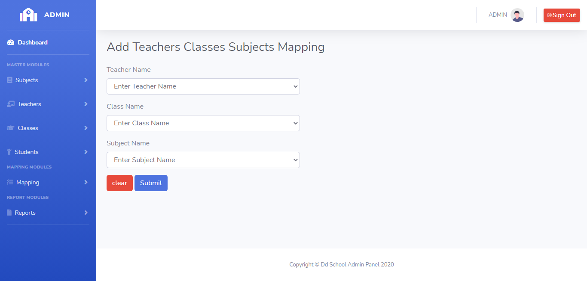
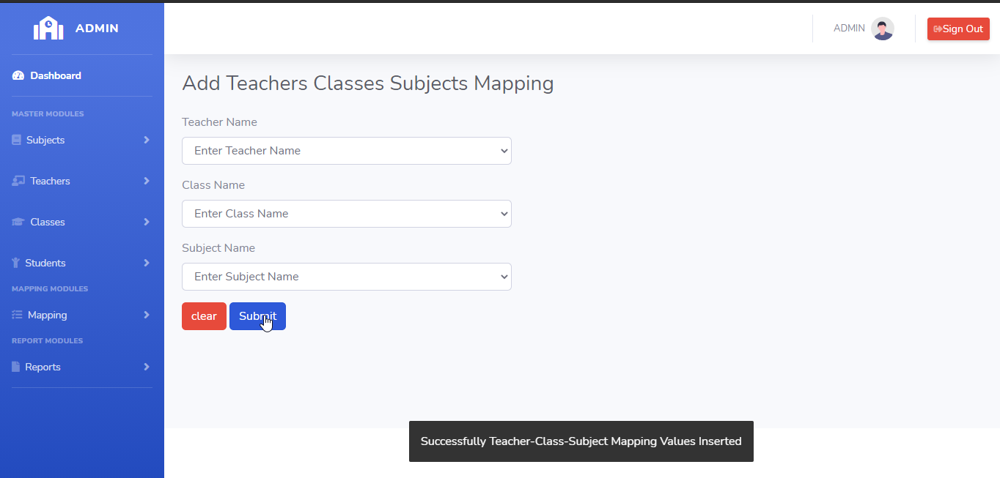
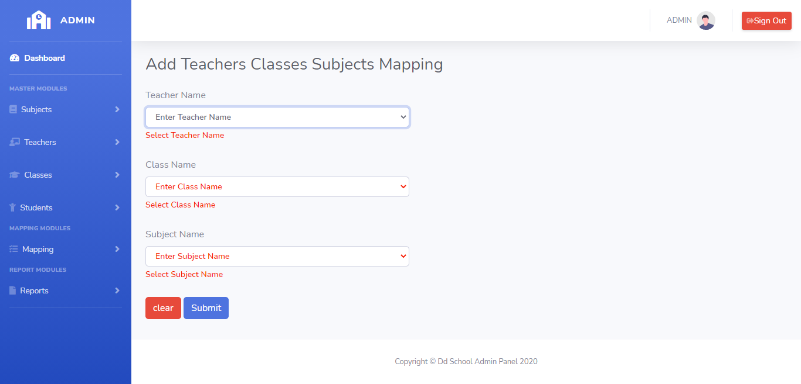
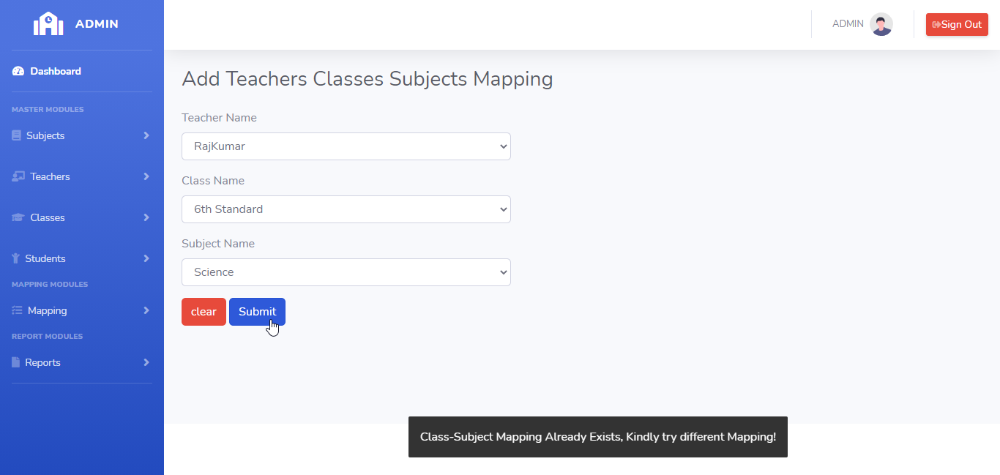

# LearnersAcademy Teachers-Classes-Subjects Mapping

## Introduction

> LearnersAcademy Teachers-Classes-Subjects Mapping Menu as two modules for Adding the Teachers-Classes-Subjects Mapping and Listing the Teachers-Classes-Subjects Mapping in the School.

## Adding Teachers-Classes-Subjects Mapping

> In the Adding Teachers-Classes-Subjects Mapping menu, Admin can able to add any number of unique Teachers-Classes-Subjects Mapping to the School.

> In the Adding Teachers-Classes-Subjects Mapping menu, Submit Button is used to submit the Teachers-Classes-Subjects Mapping values to the database and clear button is for clearing the form.

## How to Add Teachers-Classes-Subjects Mapping?

> Admin needs to enter mandatory fields in the add teachers_classes_subjects form. On clicking the submit button Teachers-Classes-Subjects Mapping details saved to the database.
 

 

#### Errors & Warnings

The below warning / error message will be displayed to the user in case of any invalid action.
The warning / error messages are self explanatory, here are few examples.

!>**Enter the Class Name**
	- If the user tries to submit in without entering the Teachers Name.

!>**Enter the Class Name**
	- If the user tries to submit in without entering the Class Name.
	
!>**Enter the Subject Name**
	- If the user tries to submit in without entering the Subject Name.
	

!>**Teachers-Classes-Subjects Mapping Already Exists,Kindly try to add different Teachers-Classes-Subjects Mapping**
	- If the user tries to submit the same class name.
	

   
{docsify-updated}

