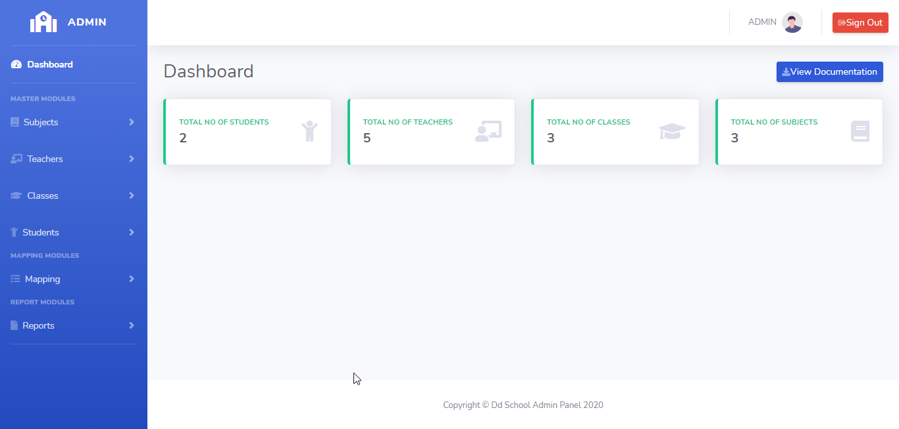
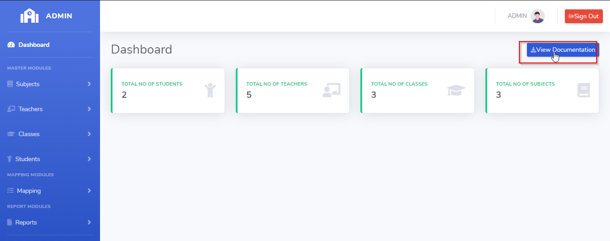
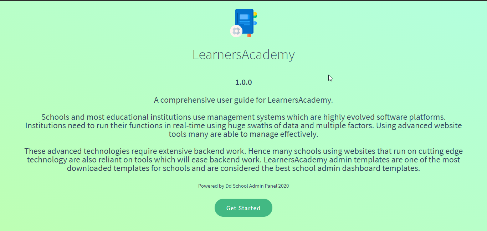
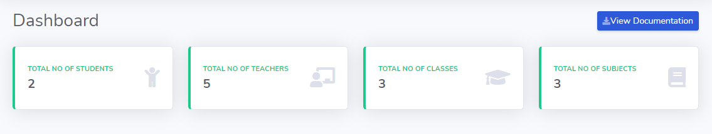
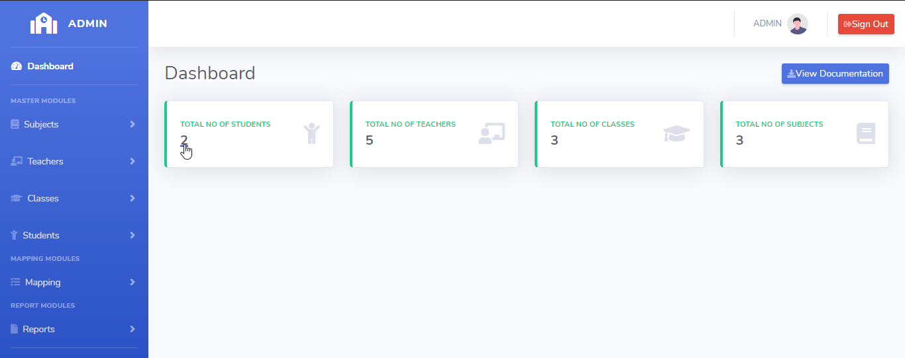
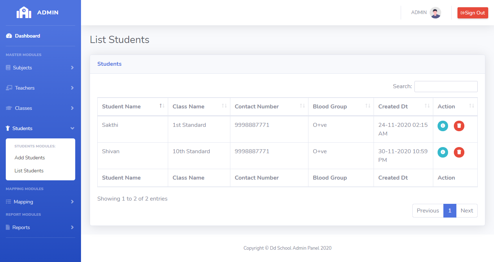

# LearnersAcademy Dashboard

## Introduction

> LearnersAcademy Dashboard page displayes the school audit details and easy links for accessing the list of Subjects,Classes,Teachers and Students.

## Documentation

> LearnersAcademy Dashboard page as the view documentation button. When the Admin clicks the button means the application open up in the new tab and user manual for the LearnersAcademy is Shown

## School Details

> Admins can easy keep tracks of the total number of Students, Teachers, Classes and Subjects in the School.
 

> Admins can easy go to the list of Subjects,Classes,Teachers and Students pages by clicking the respective tabs. For example if the Admin clicks on the Students tab means then the page automatically redirects to the list of students page.

 

{docsify-updated}

