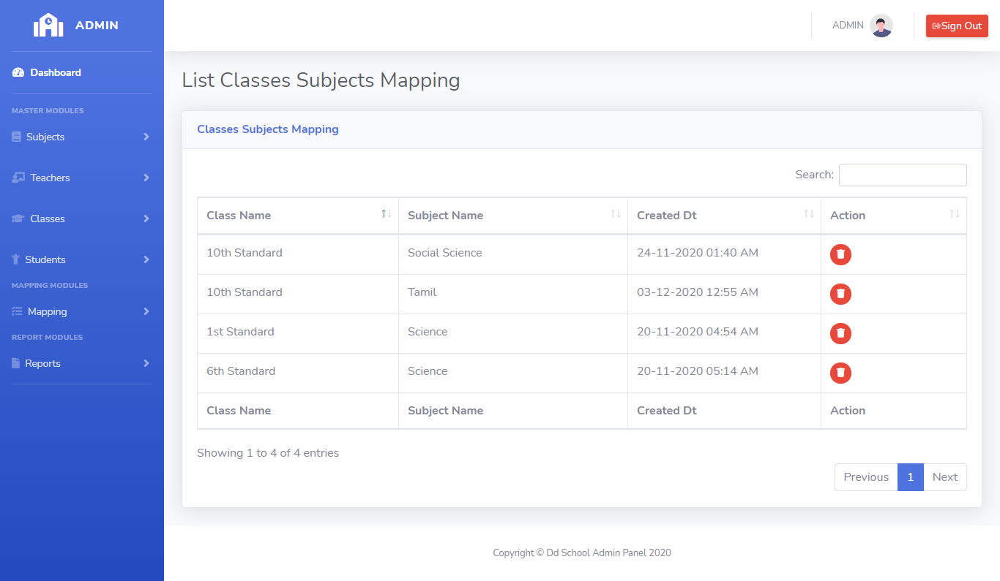
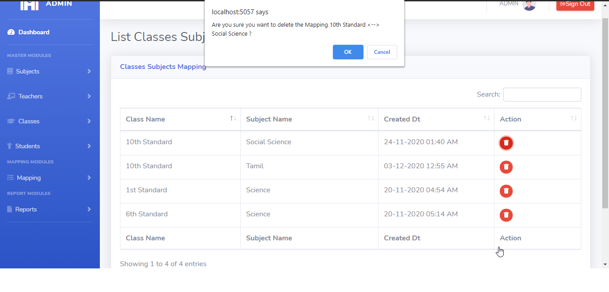

# LearnersAcademy List Classes-Subjects Mapping

## Introduction

> LearnersAcademy Class Menu as two modules for Adding the Classes-Subjects Mapping and Listing the Classes-Subjects Mapping in the School.

## List Classes-Subjects Mapping

> In the List Classes-Subjects Mapping menu, Admin can able to see the list of saved class values fetched from the database.

> In the List Classes-Subjects Mapping menu, Admin can able to delete any particular classes_subjects mapping.

## How to Delete Classes-Subjects Mapping?

> Delete button is available for every row level in the classes_subjects mapping table, By Clicking the delete button opens up the confirmation box for deleting the class. 
If user select 'Yes' then that particular class should be deleted from database and the class list table automatically refresh after the deletion completed.
 

{docsify-updated}

