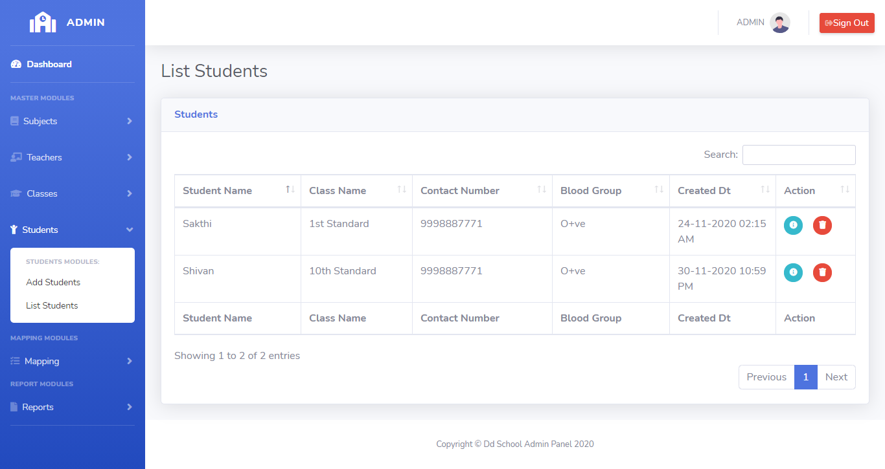

# LearnersAcademy List Students

## Introduction

> LearnersAcademy Students Menu as two modules for Adding the Students and Listing the Students in the School.

## List Students

> In the List Students menu, Admin can able to see the list of saved class values fetched from the database.

> In the List Students menu, Admin can able to delete or edit any particular students.

## How to Delete Students?

> Delete button is available for every row level in the students table, By Clicking the delete button opens up the confirmation box for deleting the class. 
If user select 'Yes' then that particular class should be deleted from database and the class list table automatically refresh after the deletion completed.
 

## How to Edit Students?

> Edit button is available for every row level in the students table, By Clicking the edit button application automatically redirects to the edit class page and fetches the values of the particular students from the database and append the values into the relevant text boxes in the edit class page. 
 

>After user changes the values of the class, then again by clicking the submit button that class values will be updated into the database.

{docsify-updated}

