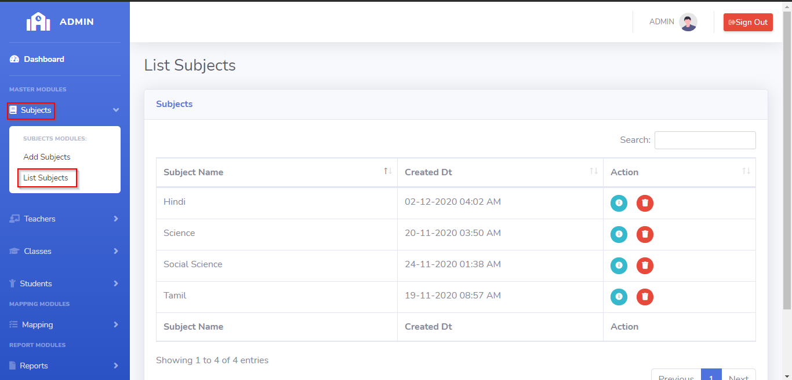
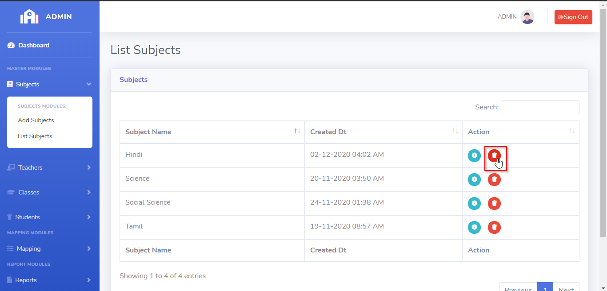
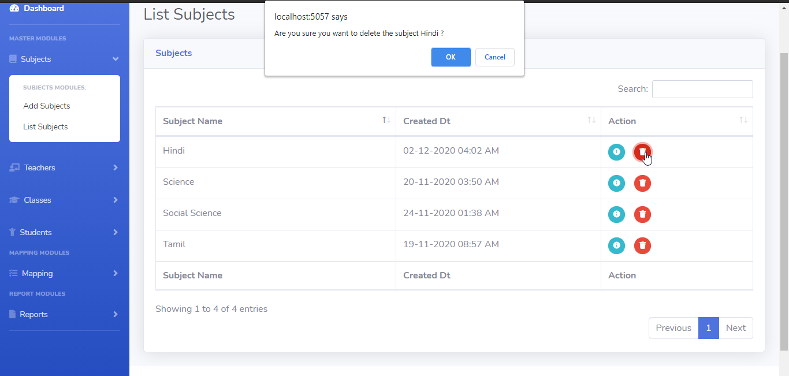
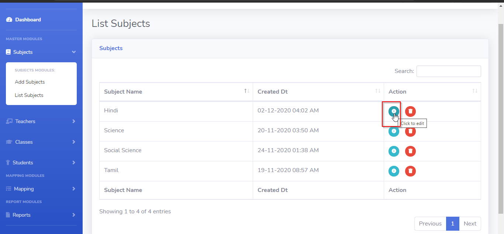
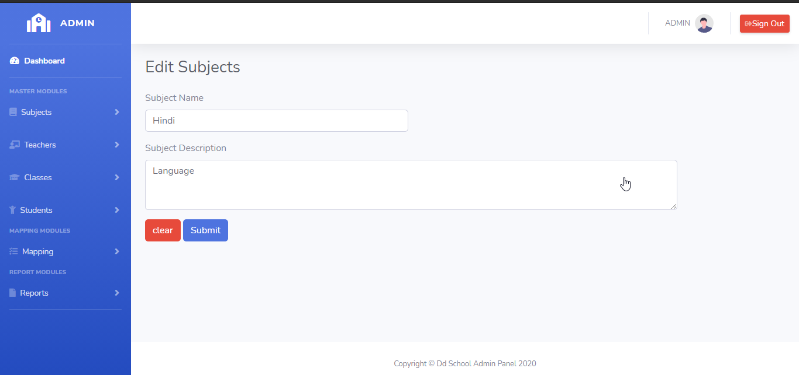
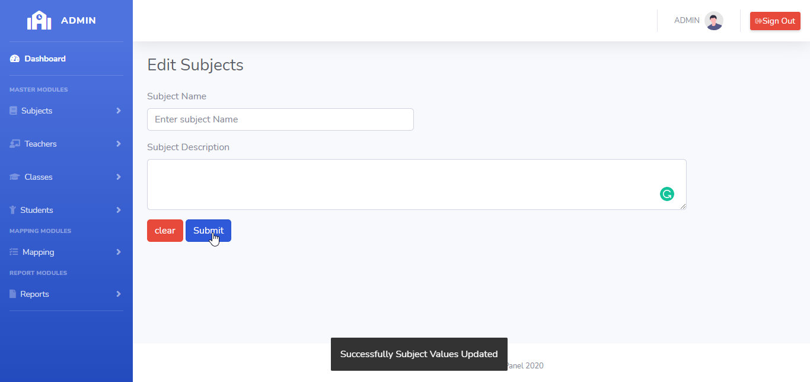

# LearnersAcademy List Subjects

## Introduction

> LearnersAcademy Subject Menu as two modules for Adding the Subjects and Listing the Subjects in the School.

## List Subjects

> In the List Subjects menu, Admin can able to see the list of saved subject values fetched from the database.

> In the List Subjects menu, Admin can able to delete or edit any particular subjects.

## How to Delete Subjects?

> Delete button is available for every row level in the subjects table, By Clicking the delete button opens up the confirmation box for deleting the subject. 
If user select 'Yes' then that particular subject should be deleted from database and the subject list table automatically refresh after the deletion completed.
 

## How to Edit Subjects?

> Edit button is available for every row level in the subjects table, By Clicking the edit button application automatically redirects to the edit subject page and fetches the values of the particular subjects from the database and append the values into the relevant text boxes in the edit subject page. 
 

>After user changes the values of the subject, then again by clicking the submit button that subject values will be updated into the database.

{docsify-updated}

