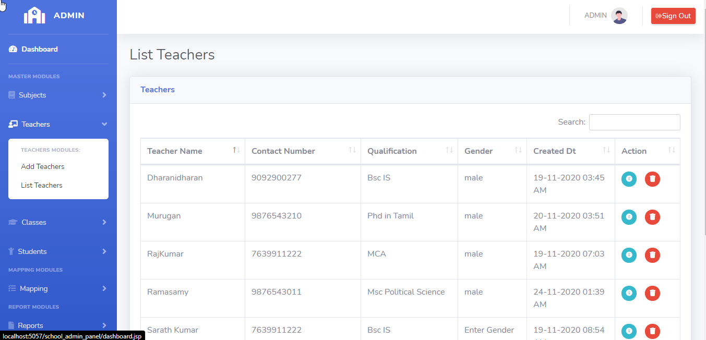
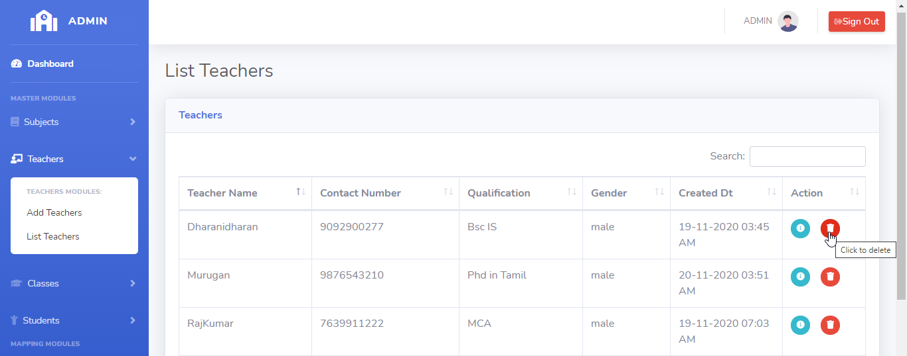
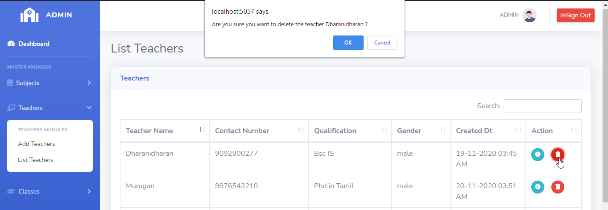
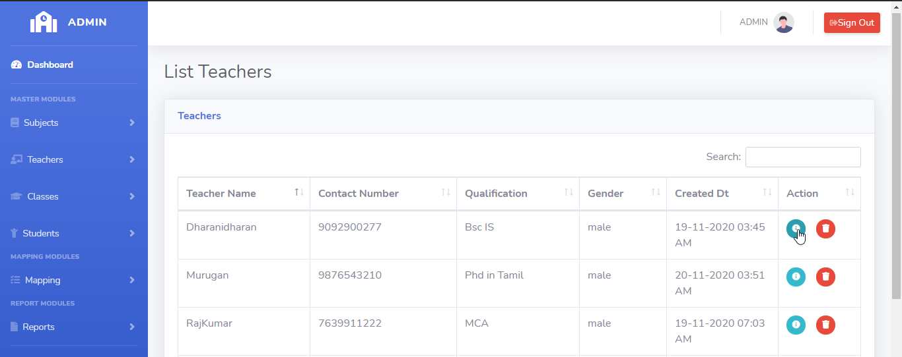
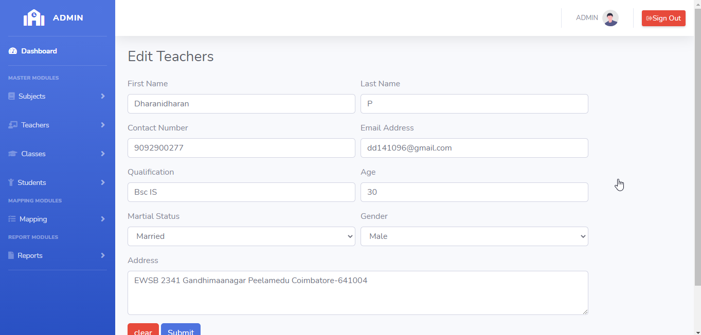
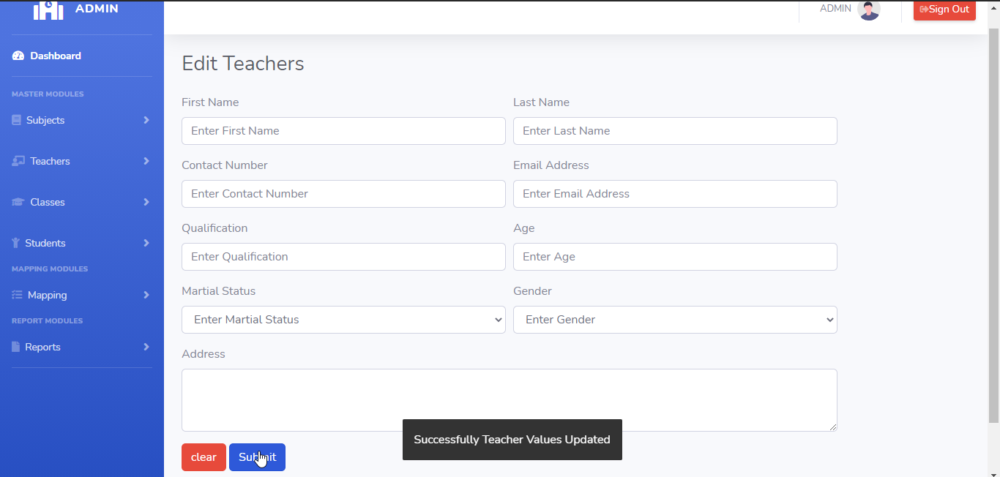

# LearnersAcademy List Teachers

## Introduction

> LearnersAcademy Teacher Menu as two modules for Adding the Teachers and Listing the Teachers in the School.

## List Teachers

> In the List Teachers menu, Admin can able to see the list of saved teacher values fetched from the database.

> In the List Teachers menu, Admin can able to delete or edit any particular teachers.

## How to Delete Teachers?

> Delete button is available for every row level in the teachers table, By Clicking the delete button opens up the confirmation box for deleting the teacher. 
If user select 'Yes' then that particular teacher should be deleted from database and the teacher list table automatically refresh after the deletion completed.
 

## How to Edit Teachers?

> Edit button is available for every row level in the teachers table, By Clicking the edit button application automatically redirects to the edit teacher page and fetches the values of the particular teachers from the database and append the values into the relevant text boxes in the edit teacher page. 
 

>After user changes the values of the teacher, then again by clicking the submit button that teacher values will be updated into the database.

{docsify-updated}

