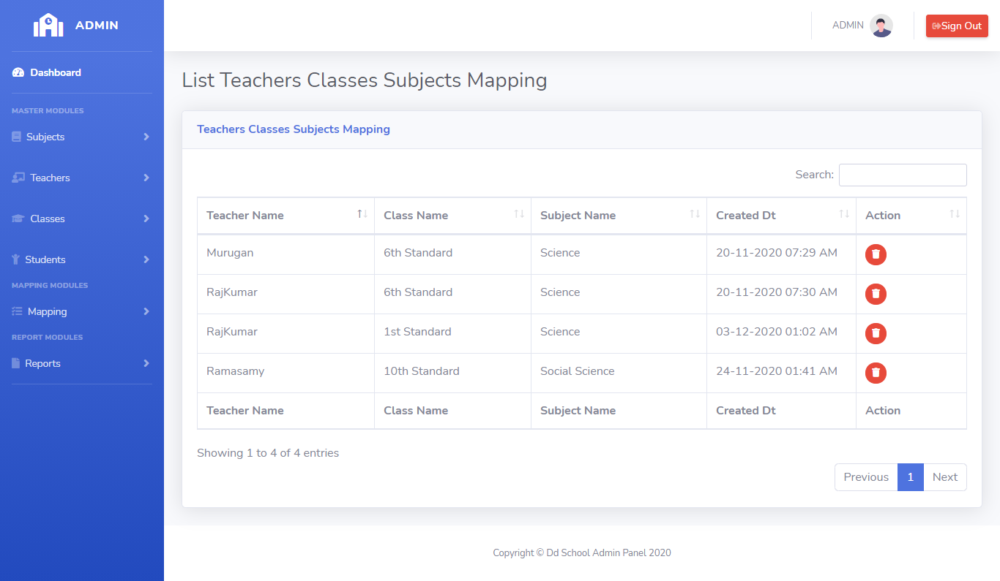

# LearnersAcademy List Teachers-Classes-Subjects Mapping

## Introduction

> LearnersAcademy Class Menu as two modules for Adding the Teachers-Classes-Subjects Mapping and Listing the Teachers-Classes-Subjects Mapping in the School.

## List Teachers-Classes-Subjects Mapping

> In the List Teachers-Classes-Subjects Mapping menu, Admin can able to see the list of saved class values fetched from the database.

> In the List Teachers-Classes-Subjects Mapping menu, Admin can able to delete or edit any particular teachers_classes_subjects.

## How to Delete Teachers-Classes-Subjects Mapping?

> Delete button is available for every row level in the teachers_classes_subjects table, By Clicking the delete button opens up the confirmation box for deleting the class. 
If user select 'Yes' then that particular class should be deleted from database and the class list table automatically refresh after the deletion completed.
 

{docsify-updated}

