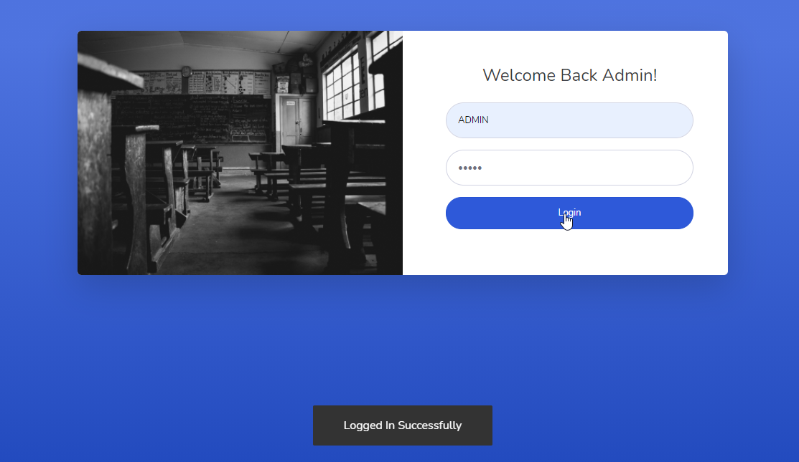

# LearnersAcademy Login

## Introduction

> Learners Academy Login Page is easy and able to access by the School Admin Only. Here for testing purpose, We developed this application to access for the single admin.

**Credentials** - For testing purpose use the user name `ADMIN` and password `ADMIN` to Explore our LearnersAcademy Portal. 

## How to Login?

> Admin needs to enter the username in the username textbox and password in the password text box. After need to click the login button to explore the application.
 

 

#### Errors & Warnings

The below warning / error message will be displayed to the user in case of any invalid action.
The warning / error messages are self explanatory, here are few examples.

!>**Enter the UserName**
	- If the user tries to log in without entering the username.
	
!>**Enter the Password**
	- If the user tries to log in without entering the password.
	

   

#### Success Messages

>**Login Successfully**
	- If the user enters the correct username and password then after clicking the login button user get the success message for login.
	

{docsify-updated}

